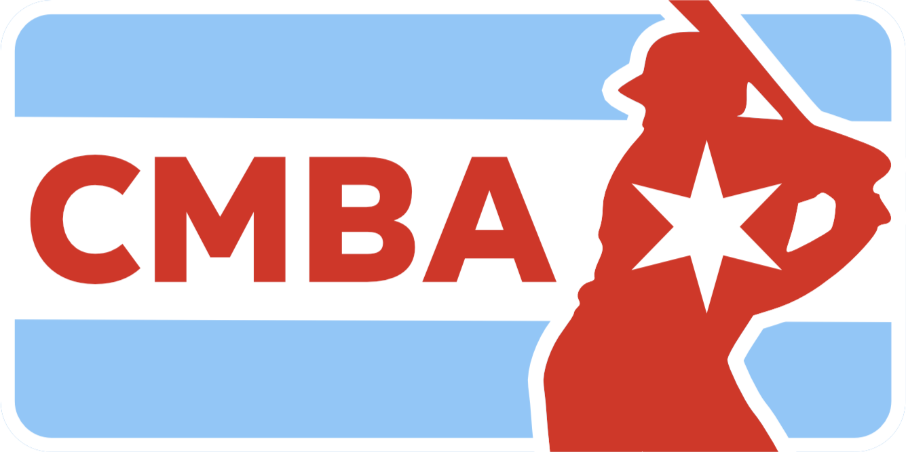

<p align="center">
  
</p>

# CMBA Bylaws, Policy, and Playing Rules

This repository contains the governing documents for the Chicago Metropolitan Baseball Association (CMBA) in Markdown form, along with the MkDocs configuration used to publish them as a static documentation site.

## Repository Layout

- `docs/index.md`: site home page
- `docs/01-bylaws.md`: league bylaws
- `docs/02-policy.md`: league policy
- `docs/03-playing-rules.md`: playing rules
- `mkdocs/mkdocs.yml`: MkDocs site configuration
- `mkdocs/requirements.txt`: Python packages required to build the site
- `tools/build.sh`: production build script
- `tools/spellcheck/`: CSpell configuration and custom baseball dictionary

## Local Development

### Requirements

- Python 3
- `pip`

### Install Dependencies

```bash
python3 -m pip install -r mkdocs/requirements.txt
```

### Preview the Site Locally

```bash
mkdocs serve -f mkdocs/mkdocs.yml
```

MkDocs serves the site locally and watches the Markdown files under `docs/` for changes.

## Editing Guidance

- Keep the canonical text in the Markdown files under `docs/`.
- Preserve the separation between bylaws, policy, and playing rules.
- Use the local preview server when editing headings, internal links, or cross-references.
- Update `tools/spellcheck/baseball-words.txt` when league-specific terminology is flagged by CSpell.

## Amendment Flow

Amendments move through three review stages before publication:

1. Draft amendments are prepared on the `draft` branch. Use this branch for active editing, internal review, and early validation.
2. Drafts may be prereleased for review by pushing a `draft*` tag. The draft prerelease provides a reviewable GitHub release and deploys the draft preview site at `/draft/`.
3. When the draft is ready for formal consideration, merge it into `release-candidate` with a merge commit. The merge commit preserves the point at which the draft moved into release-candidate review.
4. Release candidates may be prereleased for review by pushing an `rc*` tag. The release-candidate prerelease provides the version to be voted on and deploys the release-candidate preview site at `/rc/`.
5. After the amendment is voted on and approved according to the required CMBA process, merge the release candidate into `main`.
6. Publish the approved amendment from `main` by pushing a `v*` tag and creating the final GitHub release.

The final GitHub release is the published record for an approved amendment. It should include:

- an offline HTML version of the documents
- a `.docx` version of the combined bylaws, policy, and playing rules
- a `.docx` version of the playing rules only

## Publishing

Publishing is driven by GitHub Actions.

### `ci-docs`

The `.github/workflows/ci-docs.yml` workflow runs on pushes to `main`, `draft`, and `release-candidate`, and can also be started manually.

It performs the non-publishing validation steps:

- spellchecks `docs/**/*.md` and `README.md` with CSpell
- installs the MkDocs dependencies from `mkdocs/requirements.txt`
- runs a MkDocs build using `mkdocs/mkdocs.yml`

### `release`

The `.github/workflows/release.yml` workflow runs on pushed tags matching `draft*`, `rc*`, and `v*`, and can also be started manually.

It builds both the normal site and an offline site package, then publishes based on the tag prefix:

- `draft*`: creates a GitHub prerelease, attaches the offline zip and generated `.docx`, and deploys the preview site to the `gh-pages` branch under `/draft/`
- `rc*`: creates a GitHub prerelease, attaches the offline zip and generated `.docx`, and deploys the preview site to the `gh-pages` branch under `/rc/`
- `v*`: creates a GitHub release, attaches the release artifacts, and deploys the release site to the root of the `gh-pages` branch

The GitHub release description is generated from `docs/summary-of-changes.md`. Draft and release-candidate prereleases prepend a short prerelease note before that summary.

In all cases, the release workflow uses the same MkDocs configuration in `mkdocs/mkdocs.yml`, with strict mode controlled by the `MKDOCS_STRICT` GitHub Actions variable.

## Project History

The constitution and bylaws were re-architected in 2026 into the CMBA Bylaws, Policy, and Playing Rules.

The constitution and bylaws were modernized in 2021 using Google Docs. This project brings that work into Git and GitHub. Earlier commits preserve generated plain-text history of prior revisions, with the earliest tracked version dating to 2016.

## About the CMBA

The [Chicago Metropolitan Baseball Association](http://cmbabaseball.com) exists to provide a high-level amateur baseball league in Illinois and the Midwest, where developing players and veteran players can compete in a strong environment centered on baseball, sportsmanship, and community.
